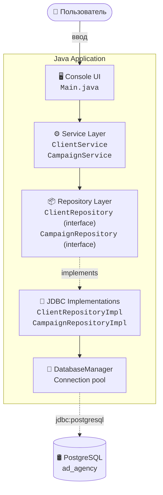
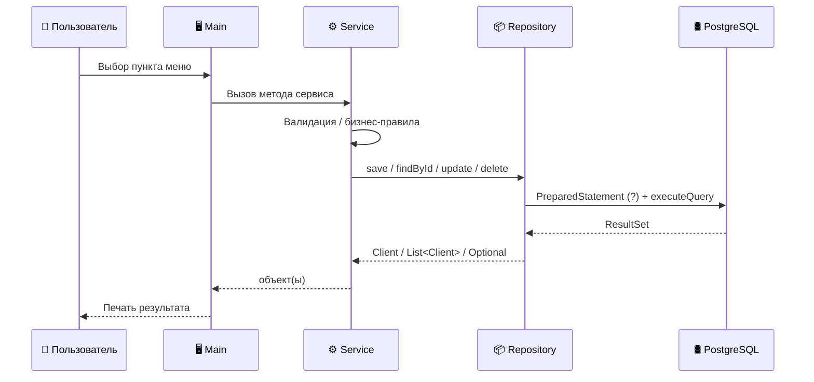
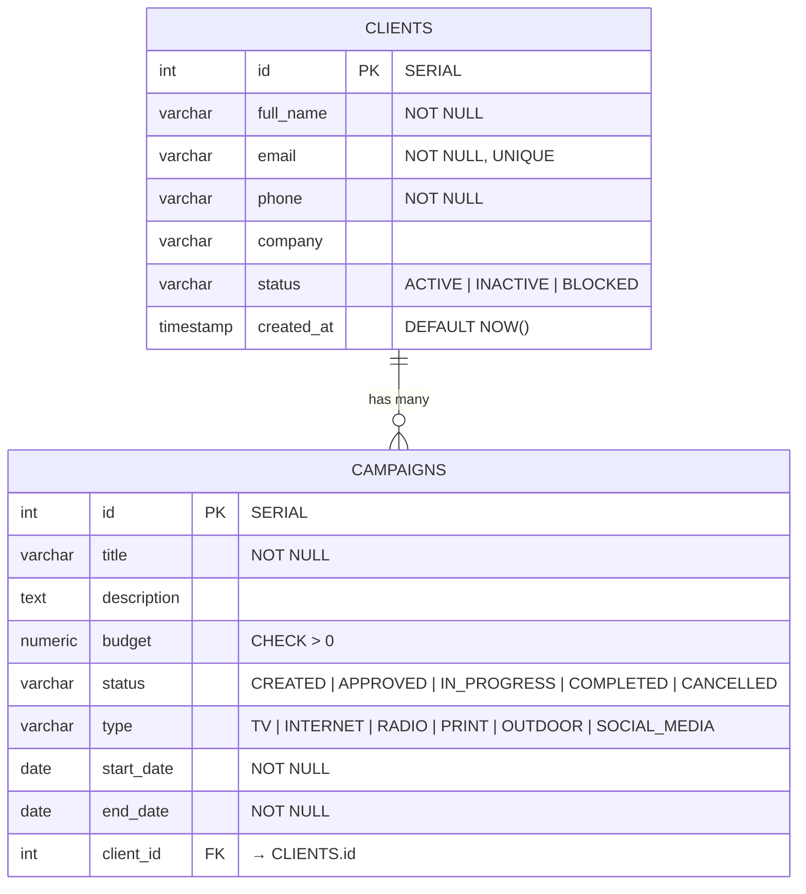

# 🎯 Ad Agency — информационная система рекламного агентства

Консольная информационная система для управления рекламным агентством. Позволяет вести учёт клиентов и рекламных кампаний, выполнять поиск, фильтрацию, сортировку, экспорт в Excel и просматривать статистику.

## 📖 О проекте

**Предметная область:** рекламное агентство.

**Основная функция:** заказ рекламной кампании.

Система поддерживает две связанные сущности:

- **Client** — клиент агентства (заказчик рекламы).
- **Campaign** — рекламная кампания, заказанная клиентом.

Кампания не может существовать без клиента (FOREIGN KEY), у клиента может быть много кампаний.

## ✨ Возможности

| Категория            | Что умеет                                                              |
| -------------------- | ---------------------------------------------------------------------- |
| **CRUD**             | Создание, чтение, обновление, удаление клиентов и кампаний             |
| **Поиск**            | По ФИО, email, компании, названию кампании (LIKE, регистронезависимый) |
| **Фильтрация**       | По статусу клиента, статусу/типу/клиенту/диапазону бюджета кампании    |
| **Сортировка**       | По имени, дате создания, бюджету (↑/↓), дате начала, названию          |
| **Статистика**       | 8 показателей: клиенты, кампании, активные, завершённые, бюджеты и др. |
| **Экспорт**          | В Excel (.xlsx) — кампании и клиенты (Apache POI)                      |
| **Валидация**        | Проверка полей, дат, FK, бизнес-правил переходов статусов              |
| **Обработка ошибок** | Не падает на неверном вводе, все ошибки — человеческим языком          |

## 🏗 Архитектура

Многослойная архитектура. Каждый слой знает только про нижележащий.



### Поток данных



---

## 🗄 Схема базы данных



### Связи

- **`campaigns.client_id` → `clients.id`** — один ко многим.
- Удалить клиента с кампаниями нельзя (защита на уровне сервиса и FK).

## 🧬 Структура проекта

```
ad-agency/
├── pom.xml
├── schema.sql
├── README.md
└── src/main/java/com/adagency/
    ├── Main.java                        # точка входа, консольное меню
    │
    ├── model/
    │   ├── Client.java                  # модель клиента
    │   ├── Campaign.java                # модель кампании
    │   ├── ClientStatus.java            # enum ACTIVE/INACTIVE/BLOCKED
    │   ├── CampaignStatus.java          # enum статусов кампании
    │   └── CampaignType.java            # enum типов рекламы
    │
    ├── repository/
    │   ├── ClientRepository.java        # интерфейс
    │   ├── CampaignRepository.java      # интерфейс
    │   └── impl/
    │       ├── ClientRepositoryImpl.java     # JDBC реализация
    │       └── CampaignRepositoryImpl.java
    │
    ├── service/
    │   ├── ClientService.java           # бизнес-логика клиентов
    │   └── CampaignService.java         # бизнес-логика кампаний
    │
    ├── exception/
    │   ├── EntityNotFoundException.java
    │   ├── BusinessException.java
    │   └── ValidationException.java
    │
    └── util/
        ├── DatabaseManager.java         # JDBC подключение
        ├── InputHelper.java             # безопасный ввод
        └── ExcelExporter.java           # Apache POI экспорт
```

## 🧠 Бизнес-правила

| #   | Правило                                                                                | Где реализовано                       |
| --- | -------------------------------------------------------------------------------------- | ------------------------------------- |
| 1   | ФИО клиента обязательно, email должен содержать `@`, телефон обязателен                | `ClientService.validate`              |
| 2   | Email клиента уникален (проверка через UNIQUE + обработка SQLException)                | `ClientService.create`                |
| 3   | Нельзя удалить клиента, у которого есть кампании                                       | `ClientService.delete`                |
| 4   | Название кампании обязательно, бюджет > 0                                              | `CampaignService.validate`            |
| 5   | Дата окончания должна быть позже даты начала                                           | `CampaignService.validate`            |
| 6   | Нельзя создать кампанию для несуществующего клиента                                    | `CampaignService.create`              |
| 7   | Разрешённые переходы статуса: `CREATED → APPROVED/CANCELLED → IN_PROGRESS → COMPLETED` | `CampaignService.ALLOWED_TRANSITIONS` |

---

## 🧪 Технологии

| Технология      | Версия | Назначение      |
| --------------- | ------ | --------------- |
| Java            | 17     | Язык            |
| Maven           | 3.8+   | Сборка          |
| PostgreSQL JDBC | 42.7.3 | Драйвер БД      |
| Apache POI      | 5.2.5  | Экспорт в Excel |

---

## 📚 Что демонстрирует проект

- ✅ **ООП:** инкапсуляция (private-поля), наследование (`ValidationException extends BusinessException`), полиморфизм (интерфейсы репозиториев)
- ✅ **Java Collections Framework:** `List`, `Map`, `Set`, `EnumSet`, `LinkedHashMap`
- ✅ **Stream API:** `filter`, `sorted`, `map`, `reduce`, `collect`
- ✅ **Enum:** 3 перечисления с бизнес-логикой
- ✅ **Кастомные исключения:** 3 типа
- ✅ **JDBC:** `Connection`, `PreparedStatement`, `ResultSet`, `try-with-resources`
- ✅ **Многослойная архитектура:** UI → Service → Repository → DB
- ✅ **Параметризованные SQL-запросы:** защита от SQL-инъекций
- ✅ **Экспорт данных:** Apache POI (xlsx)

Инструкция по запуску

1. Подготовить БД

psql -U postgres
CREATE DATABASE ad_agency;
\q
psql -U postgres -d ad_agency -f schema.sql

2. Если пароль от postgres не postgres

В IntelliJ IDEA → Run → Edit Configurations → VM options:

-Ddb.url=jdbc:postgresql://localhost:5432/ad*agency
-Ddb.user=postgres
-Ddb.password=твой*пароль

3. Собрать и запустить

mvn clean package
java -jar target/ad-agency-1.0.jar
